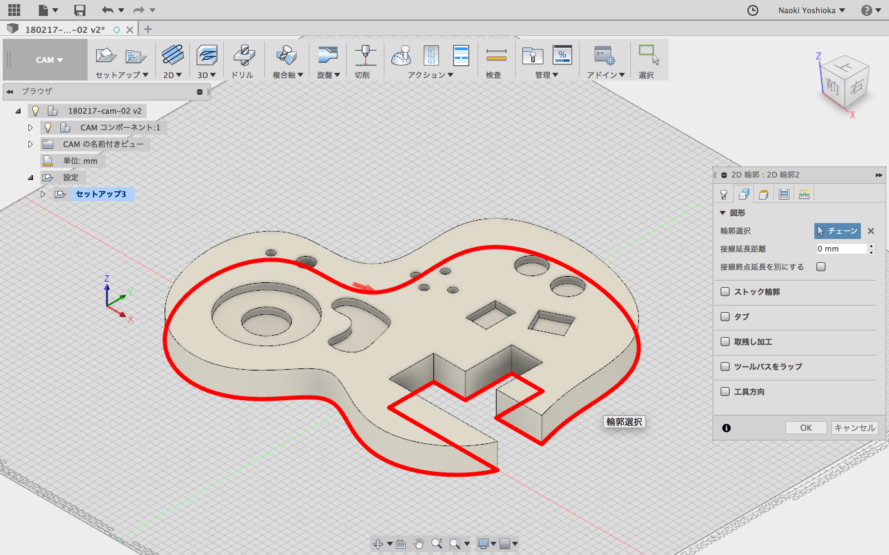
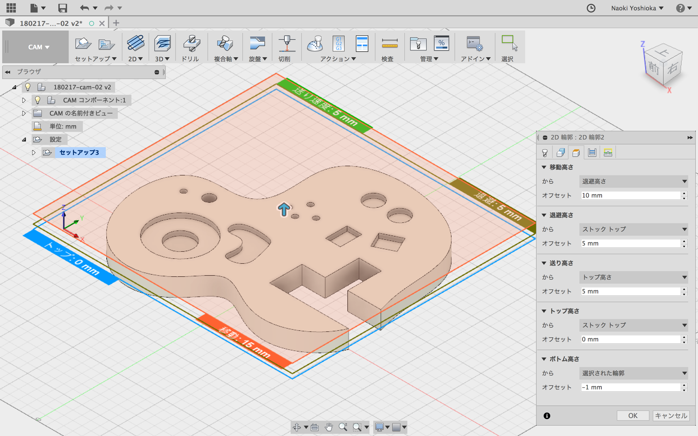
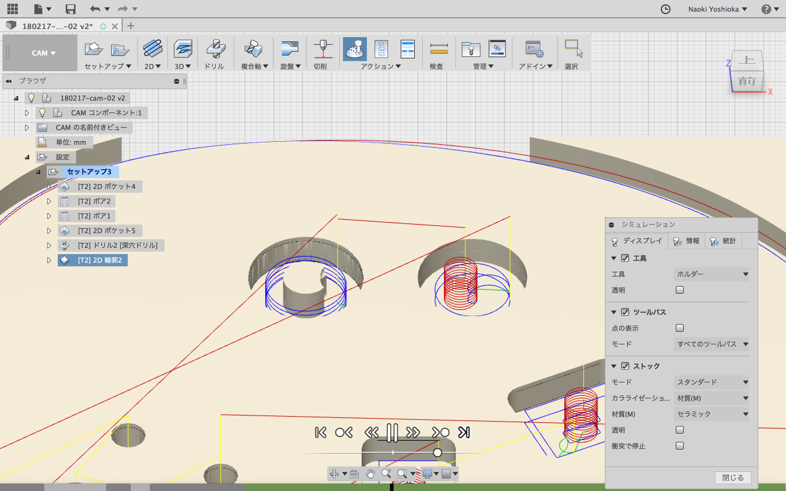
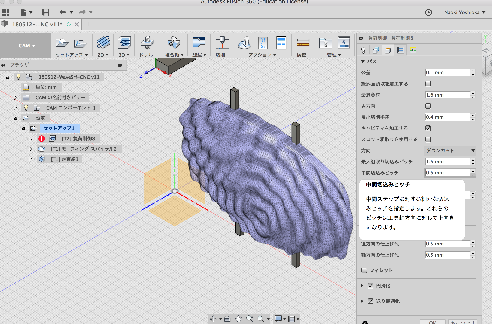
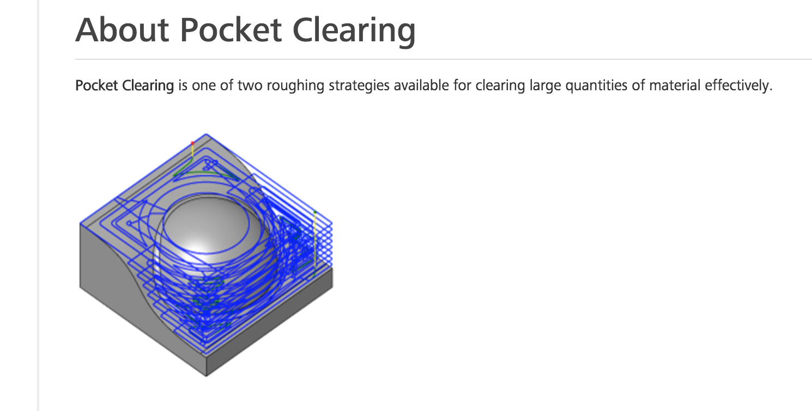
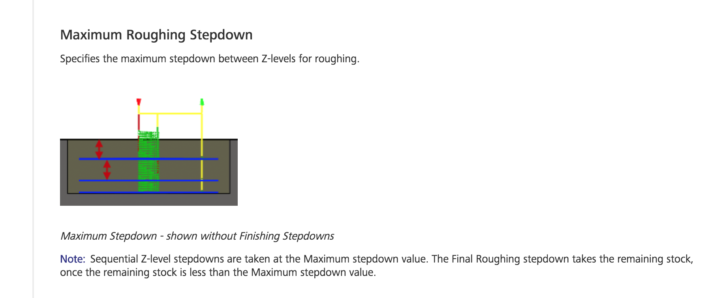
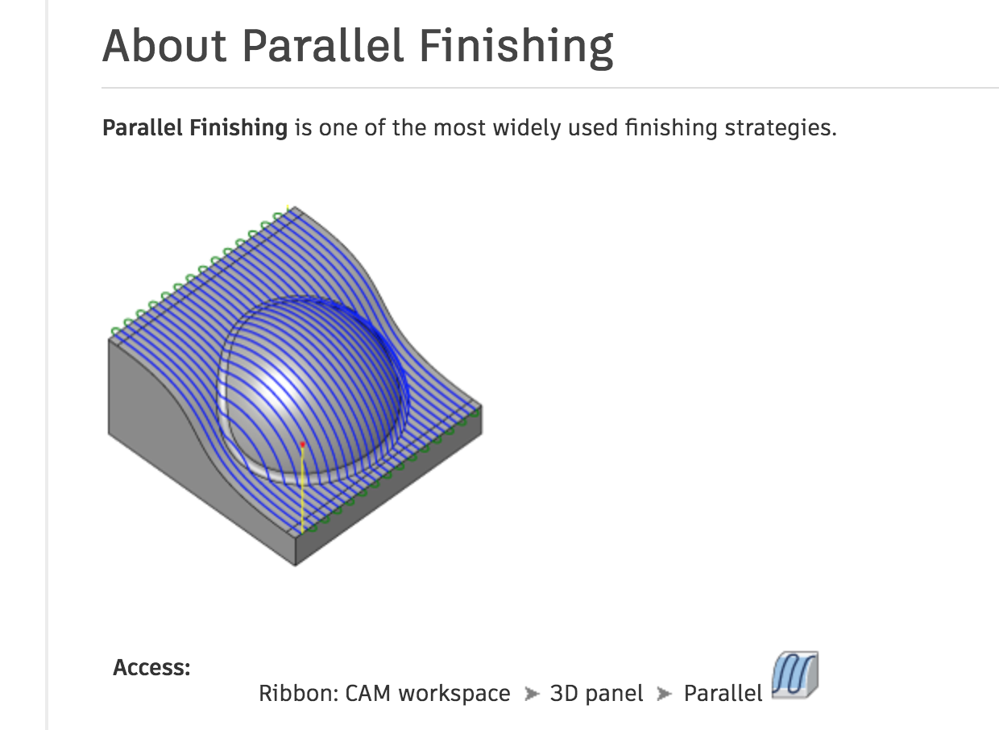
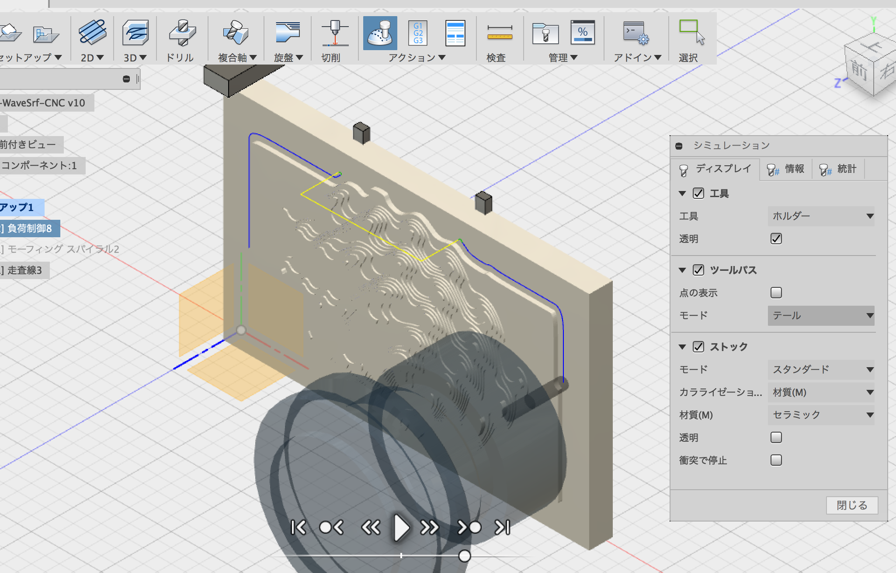
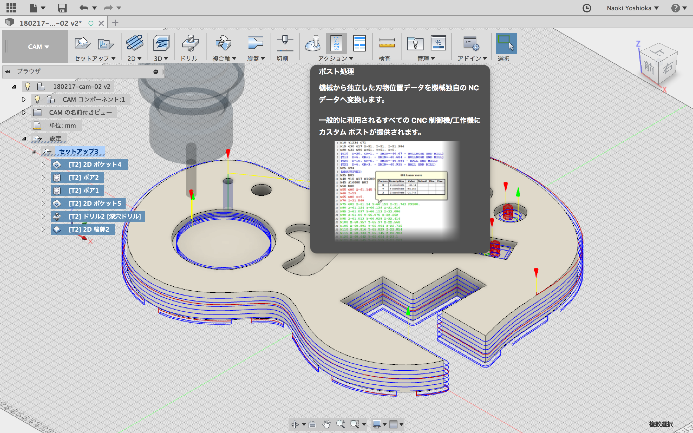
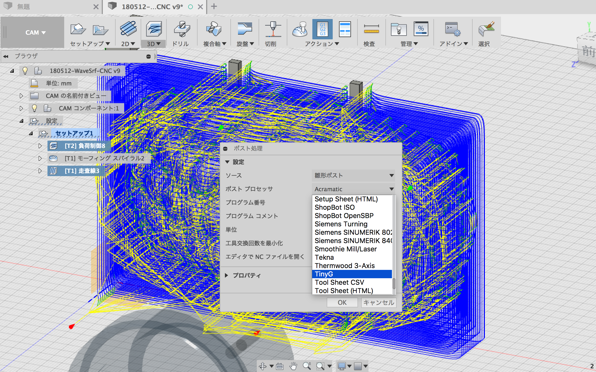

# Fusion360 の CAM の設定  

ぐぐったら、公式リファレンスがあった。これをちゃんと見るのが良さそう。    
（[http://help.autodesk.com/view/fusion360/ENU/?guid=GUID-876FEBF5-2B91-46C2-B9A5-23542418037B](http://help.autodesk.com/view/fusion360/ENU/?guid=GUID-876FEBF5-2B91-46C2-B9A5-23542418037B)）

---  

### Fusion360 の CAM の構成  

- セットアップ    
  - 新しいセットアップ（ストックなどの設定）  

- 2D   
  - 2D 輪郭（切断）  
  - 2D ドリル加工  
  - 2D ボア加工と、2D ポケット加工の違い  

- 3D
  - [粗取り] 3D 負荷制御（3D ポケットよりも、多分こっちの方が優秀）  
  - [粗取り] 3D ポケット加工  
  - [仕上げ] 走査線  
  - [仕上げ] モーフィングスパイラル  

- アクション  
  - シミュレーション（パスのチェック）  
  - ポスト処理（g code の書き出し）  

3D の曲面を切削する時は、大きく削る粗取りしてから、仕上げのよう。  
ここでエンドミルを細いのに変えても良い。  

---  

### エンドミルの種類  

フラットエンドミル  
ボールエンドミル  

---  

---  

## セットアップ

### 新しいセットアップ   

「セットアップ > 新しいセットアップ」  

ストック、ワーク座標系の設定など、  

※ワーク座標系  
ここで指定した原点を元に、g code の座標が計算される。  
デフォルトでは、モデルのバウンディングボックスの中心。  
右上や、右下などが良さそう。  

また、切り出す部材と関係ないところに、ドリル加工の穴を用意して、その中心を原点にしてあげると、機械が止まって、マシンの原点の設定が吹っ飛んでも復旧できそう。

---  

---  

## 2D  

### 2D 輪郭  

「2D > 2D 輪郭 / 2D Contour」  

切断する。  

##### ツール  

エンドミルを指定  

##### 輪郭  

輪郭を指定と、タブ（固定用の切り残し）の有無  

タブ位置は、距離ごとに自動で設定と、手動で設定があった。  

##### 高さ  

ボトム高さ  
切断の時は、余裕を持って -1mm に。捨て板まで彫り込む。

##### パス  

アップカット（右）に変更  
  

複数深さ  
今回の合板は、3mmずつ。  
[均等切り込みを使用] にチェックを入れる
  

  

円滑化、チェックを入れておく  
  

##### リンク  

進入動作の、進入と退出のチェックを外す  

ランプにチェックを入れる  
  

---  

### ドリル加工  

「ドリル > ドリル」  

##### ツール  

エンドミルを指定  

##### 図形  

同じ直径を指定で、複数の穴を自動で選べた。  
  

面を指定にすると、イラレなどのソフトの正確には円ではない穴が認識できない。  
その時はスケッチでも書いて、穴を開ける場所を設定。  
スケッチで穴を決める時は、深さが情報としてないので、深さを自分で指定。（24mm 合板に貫通される時は、深さBottom を25mm）  

##### 高さ  

輪郭と同じで、Bottom を -1 mm に。

##### サイクル  

サイクルのところで、[深穴ドリル - 完全退避]にして、少し彫り込んで、完全に上に戻るの繰り返しに設定。  
一気に開けようとすると発火した。  
ベック深さは、1回に彫り込む深さ。  
  

---  

### 2D ボア加工と、2D ポケット加工の違い  

「2D > ボア」  
「2D > 2D ポケット」  

どちらも彫り込み  

ボアは螺旋降りていく彫り込む、ポケットは彫り込んでから広げて平面を作る
（ボア : 左、ポケット : 右）  
  

ボアの方は円形のみ + エンドミルの太さx2より大きい彫り込みは、螺旋の中心が残る。  
ボアのほうが、仕上がりがキレイっぽいけど、全部ポケットでも良さそう。  
  

ポケットの方は、輪郭と同じように、複数深さで、だんだんと彫り込むように設定する。  
同様に、円滑化、進入と退出のチェックを外す。ランプはあらかじめ、螺旋になっているのでそのまま  

加工の結果  

  
  

ちょっと、2D ポケットの方は跡が残るけど、全部これでいいと思う。  

---  

---  

## 3D  

### [粗取り] 3D 負荷制御  

「3D > 負荷制御」  

大きなボリュームを削る  

粗取り（最大切り込みピッチ）からの、細かめの削りで、2段階で整えることができる  
最大切り込みピッチで 2mm、中間切り込みピッチで 0.25mm など  

3D ポケットよりも、多分こっちの方が優秀。  
ストックとの関係とかも含めて。  
メッシュからの切削パスはこれを使うのが良さそう。  
多少、計算が遅い...  

STL ファイルからのパス作成はこっちに詳しく。  
（[https://github.com/naysok/Study-CAM-Fusion360-CNC/blob/master/STL-CAM.md](https://github.com/naysok/Study-CAM-Fusion360-CNC/blob/master/STL-CAM.md)）

---  

### [粗取り] 3D ポケット加工  

「3D > 3D ポケット」  

大きなヴォリュームを削る  
  

##### パス  

最大切り込み深さで一度にどれだけ削るかを指定。  
仕上げ代という設定もあるので、それも含めて、多分決めていけば。  

  

---  

### [仕上げ] 走査線  

「3D > 走査線（Parallel Finishing）」  

走査するように滑らかに仕上げる  

  

##### パス  

切削ピッチという設定がある。細かさ  

---  

### [仕上げ] モーフィングスパイラル  

「3D > モーフィングスパイラル」  

渦を巻くように滑らかに仕上げる  

  

##### パス  

切削ピッチという設定がある。細かさ  

間隔みたいな設定があって、デフォルトではエンドミルの半径。  
内側から外側からみたいな設定もある。  

---  

---  

## アクション  

### シミュレーション（パスのチェック）  

「アクション > シミュレーション」  

パスのチェックする。  
エンドミルと材料の衝突など。  

  

---  

### ポスト処理（g codeの書き出し）  

「アクション > ポスト処理」  

  

書き出しの設定で g code の方言の指定  

  

