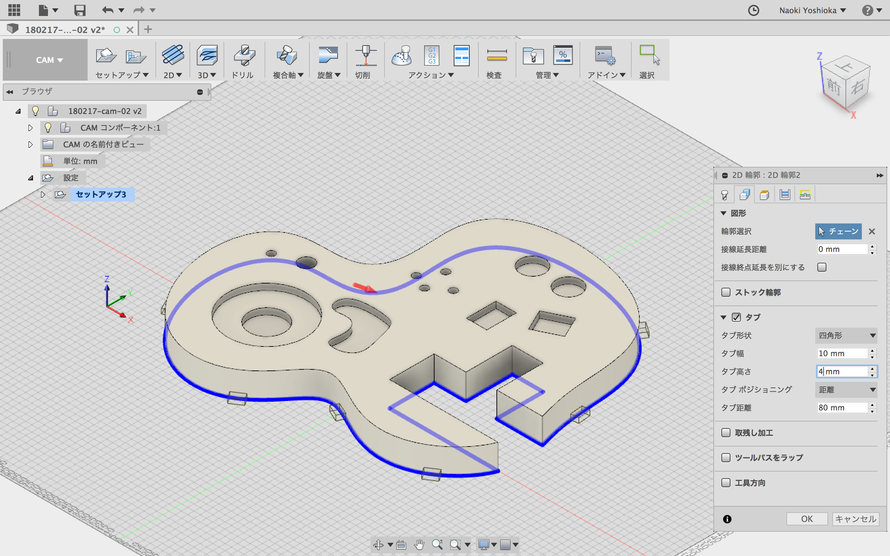
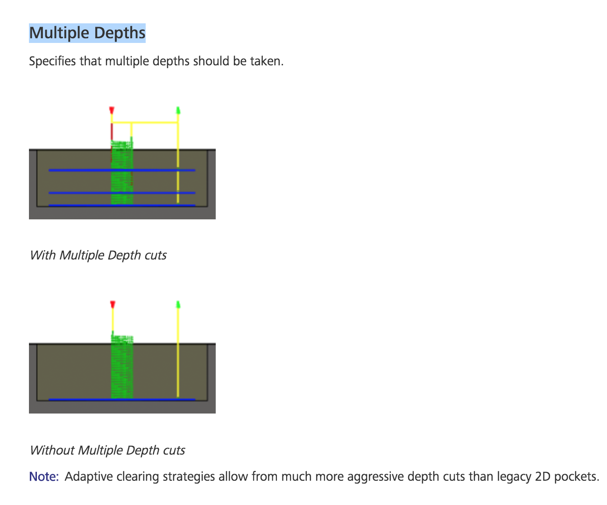
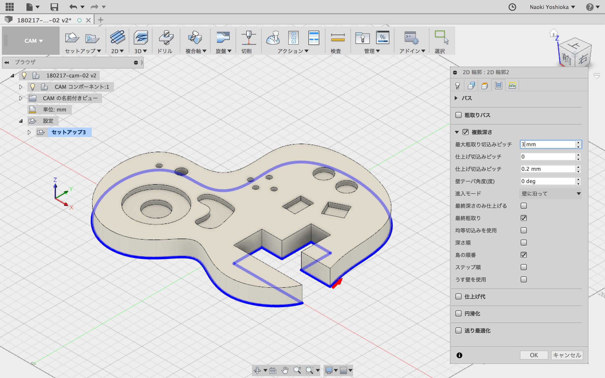
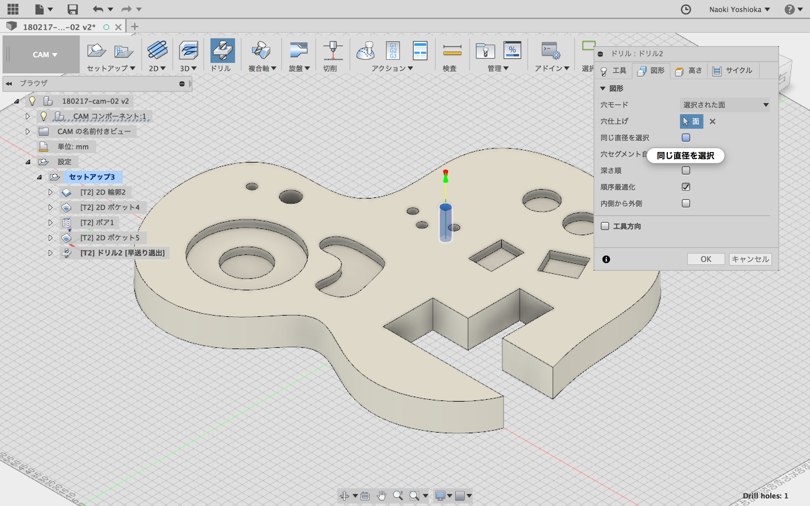
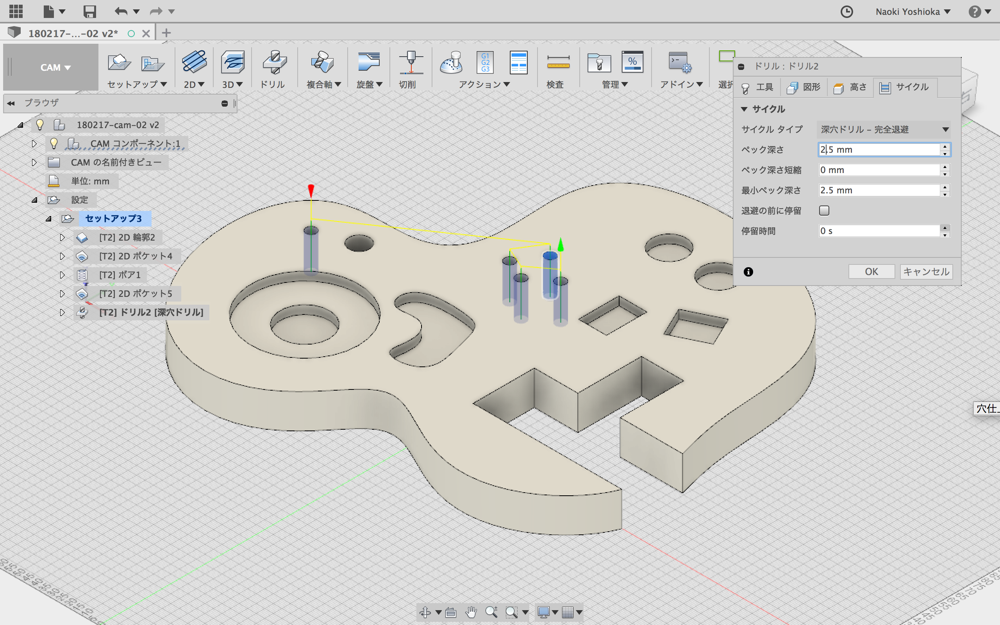
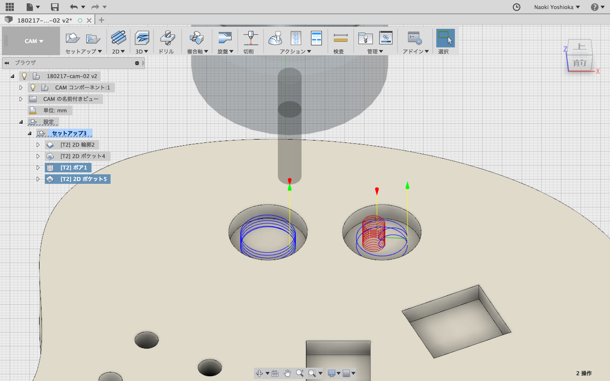
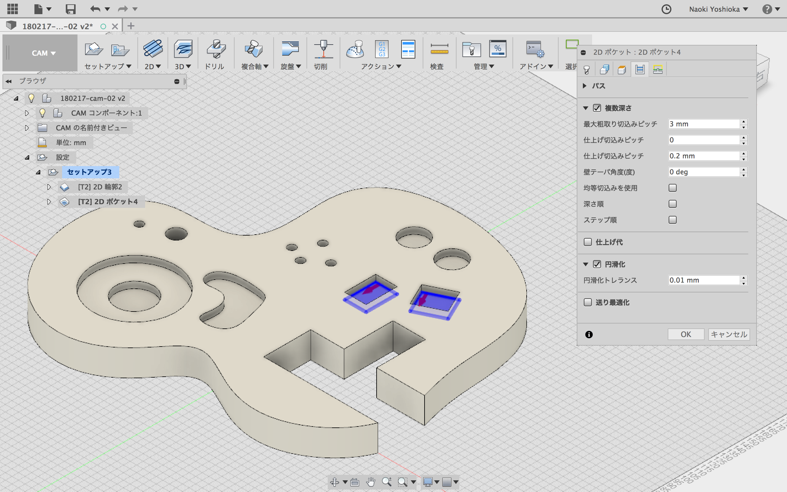
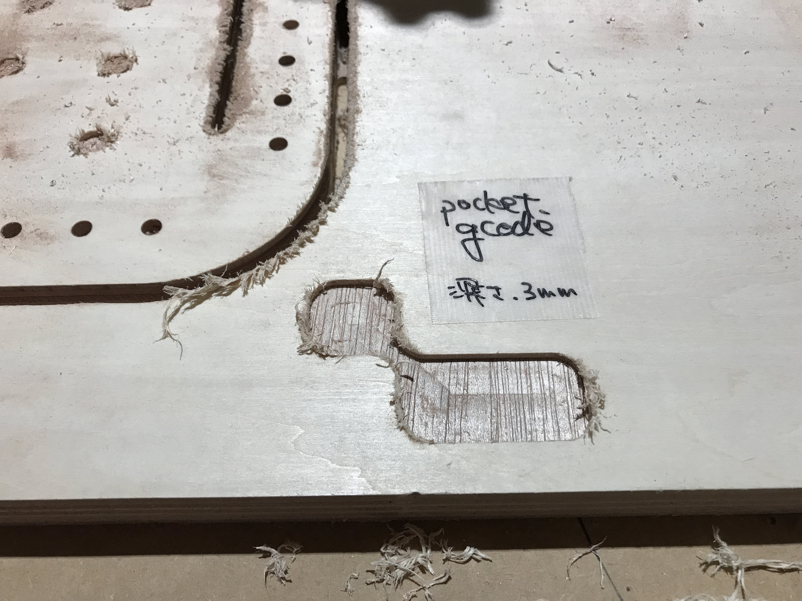

# Fusion360-CAM  

ぐぐったら、公式リファレンスがあった。これをちゃんと見るのが良さそう。    
（[http://help.autodesk.com/view/fusion360/ENU/?guid=GUID-876FEBF5-2B91-46C2-B9A5-23542418037B](http://help.autodesk.com/view/fusion360/ENU/?guid=GUID-876FEBF5-2B91-46C2-B9A5-23542418037B)）

Fusion360 の CAM の設定  
- 設定  
- 切断  
- ドリル加工  
- ボア加工とポケット加工の違い  
- g code の書き出し  

---

### 設定  

「セットアップ > 新しいセットアップ」  

ワーク座標系  

ここで指定した原点を元に、g code の座標が計算される。  
デフォルトでは、モデルのバウンディングボックスの中心。  
右上や、右下などが良さそう。  

また、切り出す部材と関係ないところに、ドリル加工の穴を用意して、その中心を原点にしてあげると、機械が止まって、マシンの原点の設定が吹っ飛んでも復旧できそう。

---  

### 切断

「2D > 2D 輪郭 / 2D Contour」  

切断。  

##### ツール  

エンドミルを指定  

##### 輪郭  

輪郭を指定と、タブ（固定用の切り残し）の有無  

タブ位置は、距離ごとに自動で設定と、手動で設定があった。  

##### 高さ  

ボトム高さ  
切断の時は、余裕を持って -1mm に。捨て板まで彫り込む。

##### パス  

アップカット（右）に変更  
  

複数深さ  
今回の合板は、3mmずつ。  
[均等切り込みを使用] にチェックを入れる
  

  

円滑化、チェックを入れておく  
  

##### リンク  

進入動作の、進入と退出のチェックを外す  

ランプにチェックを入れる  
  

---  

### ドリル加工  

「ドリル > ドリル」  

##### ツール  

エンドミルを指定  

##### 図形  

同じ直径を指定で、複数の穴を自動で選べた。  
  

面を指定にすると、イラレなどのソフトの正確には円ではない穴が認識できない。  
その時はスケッチでも書いて、穴を開ける場所を設定。  
スケッチで穴を決める時は、深さが情報としてないので、深さを自分で指定。（24mm 合板に貫通される時は、深さBottom を25mm）  

##### 高さ  

輪郭と同じで、Bottom を -1 mm に。

##### サイクル  

サイクルのところで、[深穴ドリル - 完全退避]にして、少し彫り込んで、完全に上に戻るの繰り返しに設定。  
一気に開けようとすると発火した。  
ベック深さは、1回に彫り込む深さ。  
  

---  

### ボア加工とポケット加工の違い  

「2D > ボア」  
「2D > 2D ポケット」  

どちらも彫り込み  

ボアは螺旋降りていく彫り込む、ポケットは彫り込んでから広げて平面を作る
（ボア : 左、ポケット : 右）  
  

ボアの方は円形のみ + エンドミルの太さx2より大きい彫り込みは、螺旋の中心が残る。  
ボアのほうが、仕上がりがキレイっぽいけど、全部ポケットでも良さそう。  
  

ポケットの方は、輪郭と同じように、複数深さで、だんだんと彫り込むように設定する。  
同様に、円滑化、進入と退出のチェックを外す。ランプはあらかじめ、螺旋になっているのでそのまま  

加工の結果  

  
  

---  

### g code の書き出し  

「アクション > ポスト処理」  

