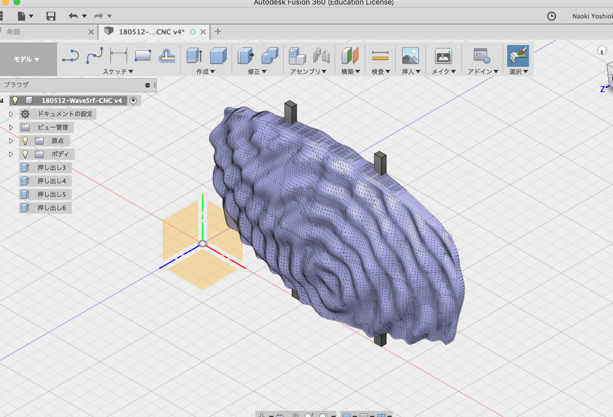
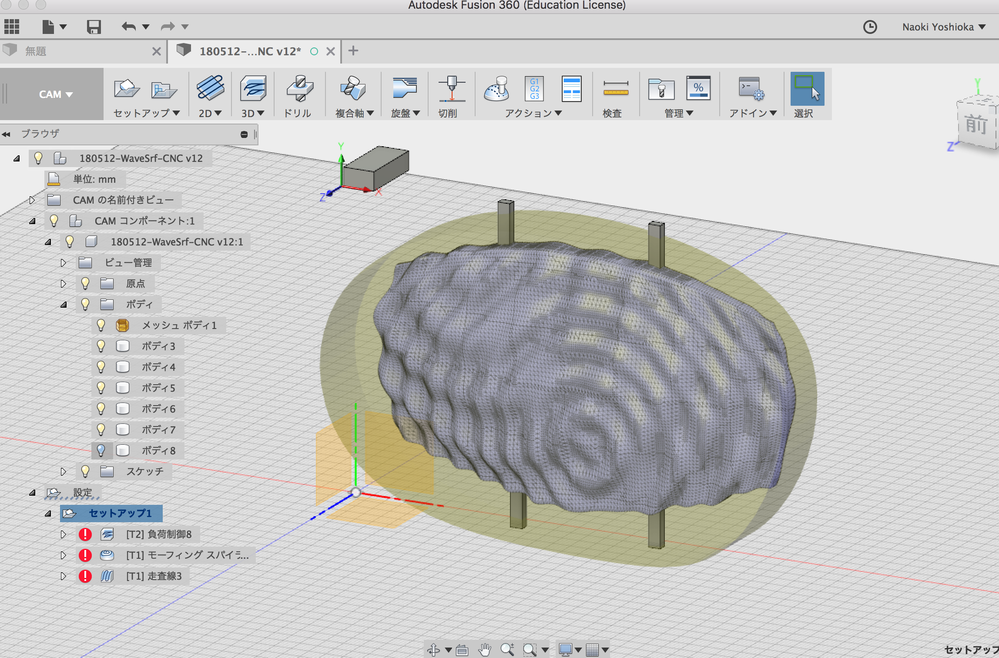
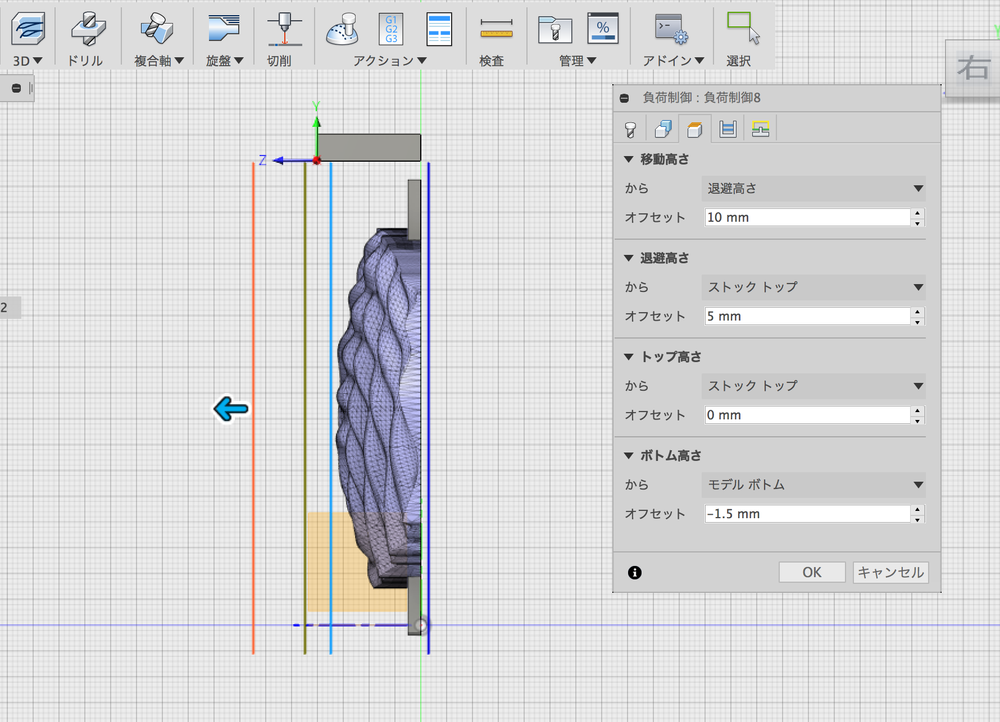
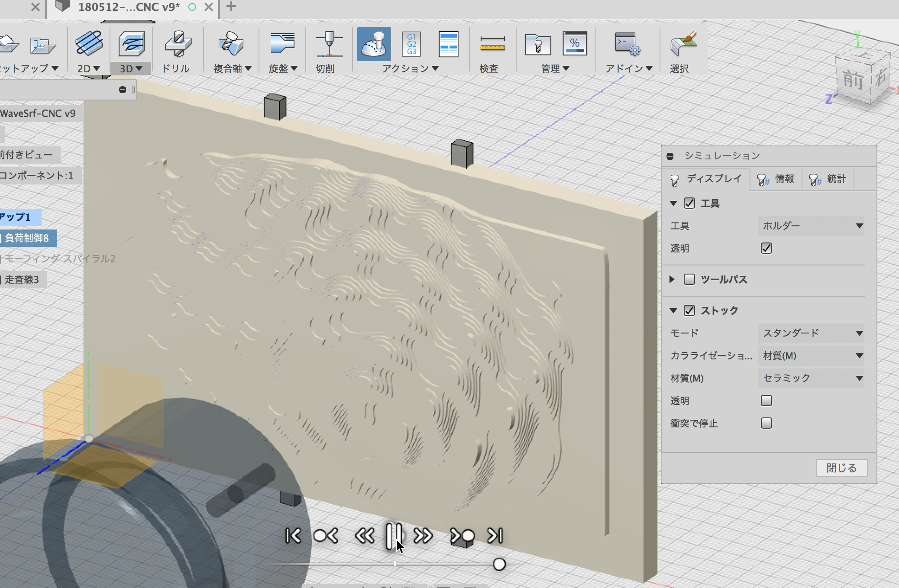
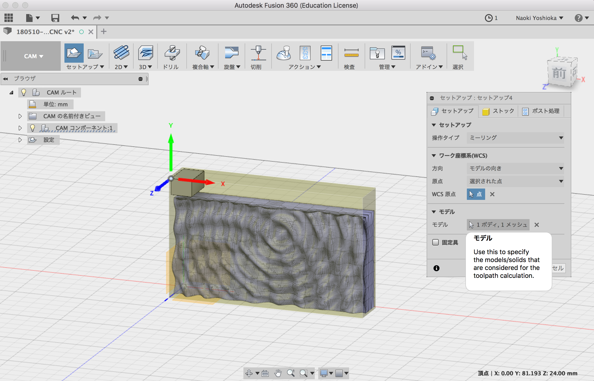
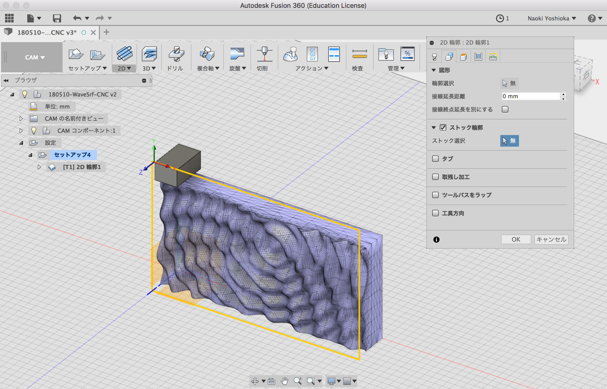

# STL-CAM  

メッシュ (STL) から切削パスを生成 → とりあえずできた  

色々試しているけど、メッシュの扱いはあまり賢くない...  

---  

メッシュの切削は、材料の塊から掘り残すみたいな  

### 脚を追加  

普通にモデリング  
材料に削り残す脚を追加する  
Brep でブーリアンしなくても良い、形は適当に。  

  

  

### セットアップ  

「セットアップ > 新規セットアップ」  

削り落とすために、メッシュの周辺にストックを設定。  
それも削って、結果切り落としに。  

~~バウンディングボックスか円筒形か、その辺はメッシュの形に合わせて選ぶ。~~  
ソリッドから作れる!!  

※ ソリッドの場合  

ソリッドから、ストックを作れるので、STL の周りに適当にスケッチを書いて、 Extrude  
それをセットアップの中でストックに設定。材料と時間節約。  

削り落としのために、輪郭は余裕をとって、エンドミルの径 + 1~2 mm 程度  

  

  

※ バウンディングボックスの場合  

セットアップ > モデル のところでメッシュを選択  
ストック > サイドを追加  

エンドミルの径 + 1~2 mm 程度  

  

### 3D 負荷制御  

「3D > 負荷制御」  

大きなボリュームを削る  

粗取り（最大切り込みピッチ）からの、細かめの削りで、2段階で整えることができる  
最大切り込みピッチで 2mm、中間切り込みピッチで 0.25mm など  
形によっては仕上げ不要？  

高さのタブで、移動の高さと、ボトムの高さの設定。  
切り落とす時は、ボトムの設定はマイナス(捨て板に打ち込む分で、 -1mm とか)にするとストックの下まで彫り込めるので、実質的に、切断。  
この時に脚をつけて置くと板から外れずに済む  

  

3D ポケットよりも、多分こっちの方が優秀。  
ストックとの関係とかも含めて。  
メッシュからの切削パスはこれを使うのが良さそう。  

多少、計算が遅い...  

### シミュレーション

接触を確認  
ここの情報のタブでかかる時間も見れる   

  

動画リンク ↓  

  

### ポスト処理  

書き出しの設定で g code の方言の指定  

  

---  

---  

## ※こここから下は失敗してた時のもの  

### セットアップ  

エンドミル交換等に使えるように、切削エリアとは別の所に、原点。メッシュ + Brep でストックとしてくくる。  

  

### 3D ポケット  

選び方によって、ストック全体からの削り出しになった。これはアホ。  

  

選び方を何か変えたら、表面だけできた。  
これと仕上げ（+ 輪郭）を組み合わせてやればいけるはず。  

  

### 2D 輪郭  

メッシュのエッジは使えずに、ストックの全体の輪郭しか使えない。  
ストックと切削モデルを同じ形にするか、加工パス出し用の捨てデータかスケッチかなんらかが必要。

  

### その他  

STL 部分で加工範囲を作ってその加工範囲を指定で加工、エンドミル交換用の位置合わせ点は、machine zeroの x に +10mm地点でばみるとか...。  

そもそも、これは、直方体のデータで、ストックとほぼ同じ形の場合なので、他の場合はまた違うかな。  

