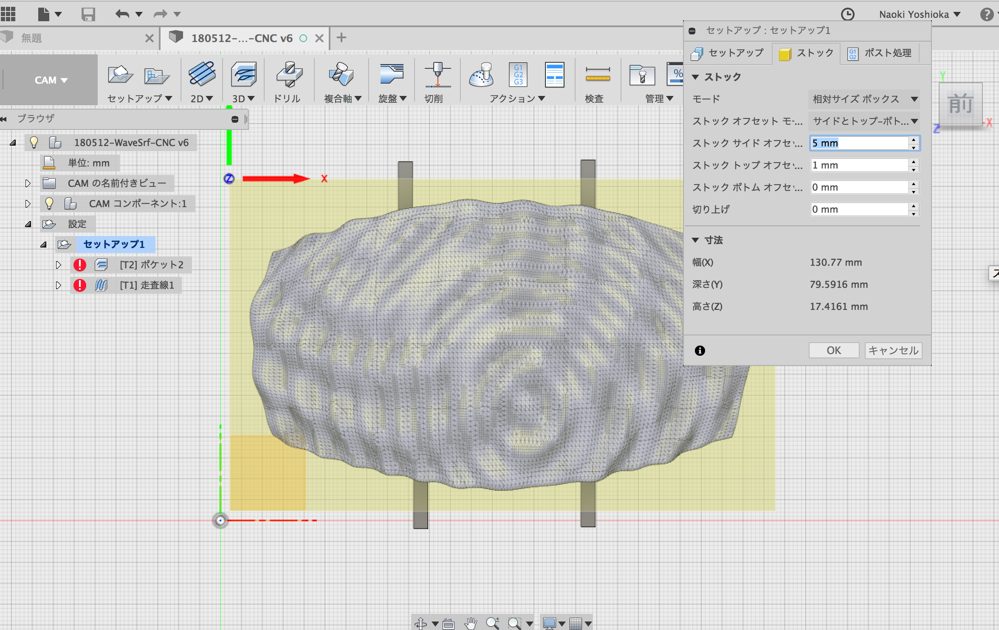
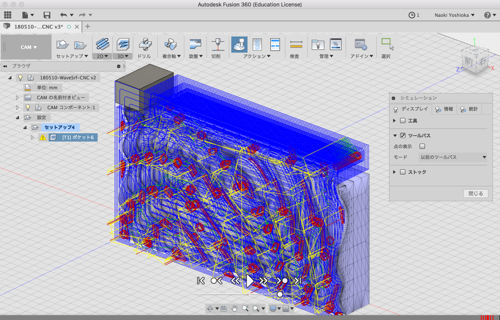

# STL-CAM  

メッシュ (STL) から切削パスを生成 → とりあえずできた  

色々試しているけど、メッシュの扱いはあまり賢くないのでは...  

---  

メッシュの切削は、材料の塊から掘り残すみたいな感じ  

### 脚を追加  

  

  

### セットアップ  

セットアップ > モデル のところでメッシュを選択  
ストック > サイドを追加  

  

### 3D 負荷制御  

### シミュレーション

ここの情報のタブでかかる時間も見れる   

  

動画リンク ↓  

  

### ポスト処理  

書き出しの設定で g code の方言の指定  

  

---  

---  

## ※こここから下は失敗してた時のものです。  

### セットアップ  

エンドミル交換等に使えるように、切削エリアとは別の所に、原点。メッシュ + Brep でストックとしてくくる。  

  

### 3D ポケット  

選び方によって、ストック全体からの削り出しになった。これはアホ。  

  

選び方を何か変えたら、表面だけできた。  
これと仕上げ（+ 輪郭）を組み合わせてやればいけるはず。  

  

### 2D 輪郭  

メッシュのエッジは使えずに、ストックの全体の輪郭しか使えない。  
ストックと切削モデルを同じ形にするか、加工パス出し用の捨てデータかスケッチかなんらかが必要。

  

### その他  

STL 部分で加工範囲を作ってその加工範囲を指定で加工、エンドミル交換用の位置合わせ点は、machine zeroの x に +10mm地点でばみるとか...。  

そもそも、これは、直方体のデータで、ストックとほぼ同じ形の場合なので、他の場合はまた違うかな。  

